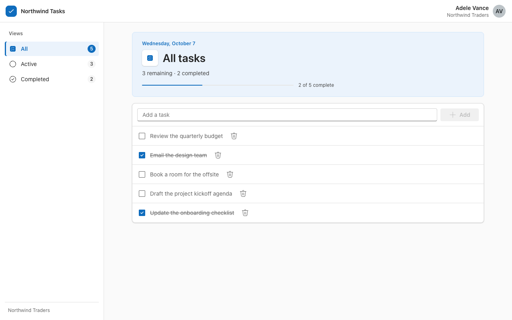
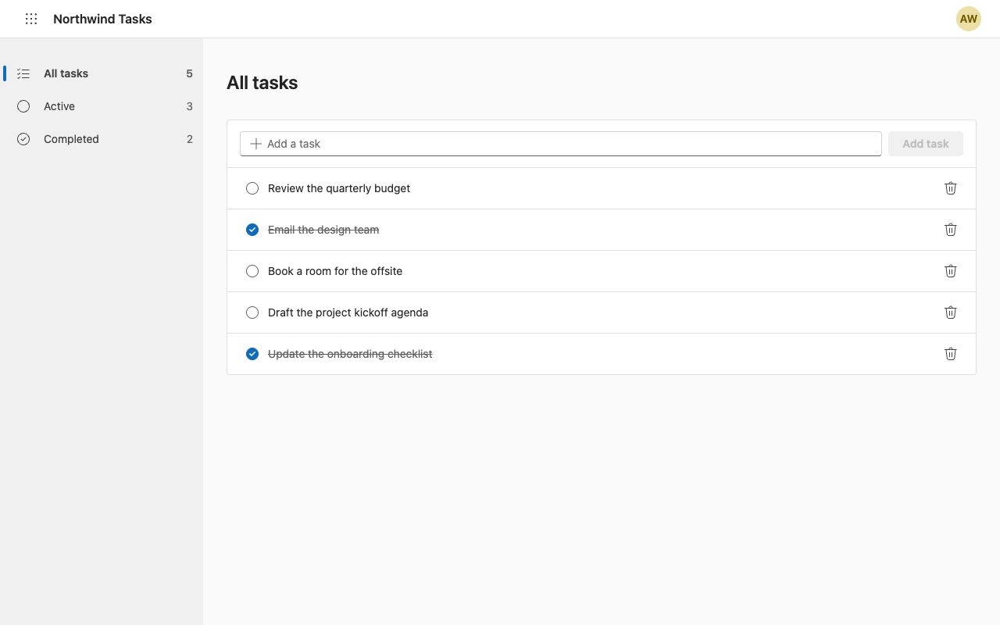
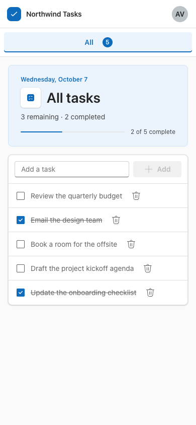
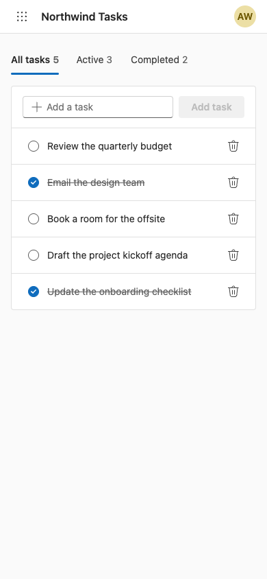
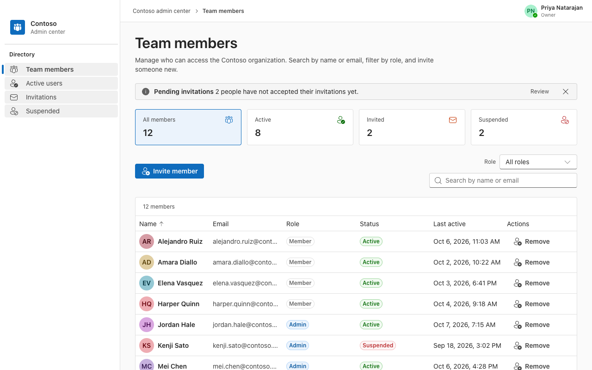
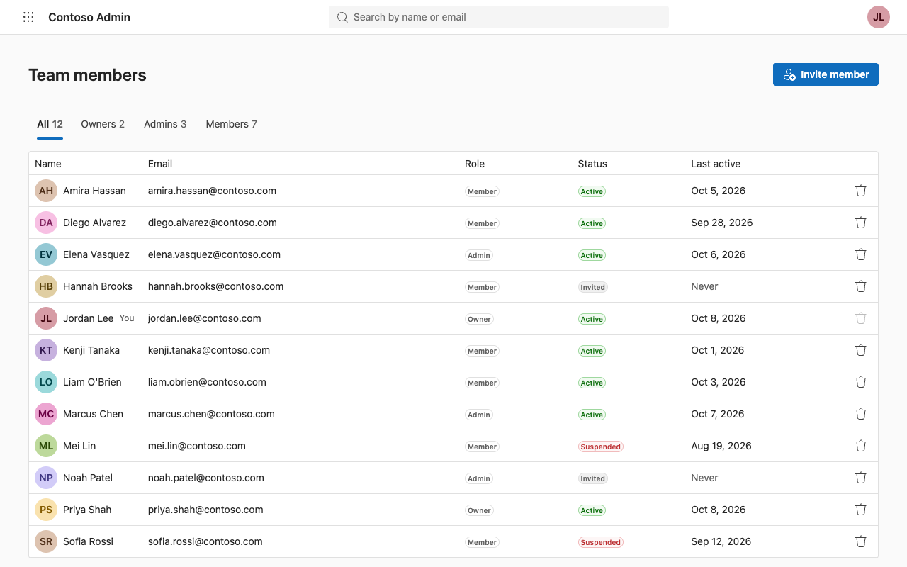

# fskill

fskill is an agent skill that makes your coding agent build React frontends in Microsoft's Fluent 2 design language. Add it to [OpenCode](https://opencode.ai/), then ask for a web app as you normally would. The agent builds it with [Fluent UI React v9](https://react.fluentui.dev/) (`@fluentui/react-components`) and the layout, spacing, type, and wording of a Microsoft 365 web app.

## What changes in your app

The same request, "Build a todo list web app. Make it look and feel like a professional Microsoft web app," given to the same agent.

| Without fskill | With fskill |
| --- | --- |
|  |  |
|  |  |

An admin page for managing team members:

| Without fskill | With fskill |
| --- | --- |
|  |  |

Without a design system to follow, an agent tends to add things nobody asked for: hero banners, progress bars, stat cards, and the same count in three places. It also breaks on phones. fskill gives the agent one design system, starter files, and a checker, and tells it to build exactly the features you asked for.

With fskill, the agent:

- Starts from four starter files: `Root` sets up the Fluent theme, `AppShell` draws the Microsoft 365 suite header and left menu, `DataTable` shows records and turns into a stacked list on phones, and `EmptyState` covers views with no items.
- Uses Fluent components such as `Button`, `Input`, `Checkbox`, `Dialog`, `TabList`, and `Toast` instead of hand-built ones.
- Styles with `makeStyles` and Fluent `tokens`, with no raw hex colors or off-ramp spacing.
- Follows Microsoft 365 patterns: delete with an **Undo** toast, Save and Discard that stay disabled until something changes, and no way to remove your own account or the last owner.
- Writes UI text the Microsoft way, in sentence case, with a verb on every button.
- Runs `scripts/check.mjs` on the app and fixes what it reports before it finishes.

fskill does not add features, animation libraries, or a design system of its own.

## Requirements

- A React 18 or later app. The agent adds `@fluentui/react-components` and `@fluentui/react-icons` if the app lacks them.
- OpenCode.
- Node.js, to run the checker.

fskill targets Fluent UI React v9 only. It does not cover Fluent UI Web Components, Fluent UI React v8, or native platforms. fskill uses the [Agent Skills](https://github.com/agentskills/agentskills) format, so other tools that read that format may load it, but it is tested in OpenCode only.

## Install fskill

Copy the `skills/fskill` folder into your project at `.opencode/skills/fskill`.

```bash
git clone https://github.com/<owner>/fskill.git /tmp/fskill
mkdir -p .opencode/skills
cp -r /tmp/fskill/skills/fskill .opencode/skills/fskill
```

To use fskill in every project, copy the folder to `~/.config/opencode/skills/fskill` instead. See [OpenCode skills](https://opencode.ai/v2/docs/skills/) for the other folders OpenCode reads.

## Use fskill

Ask for the app. The agent loads fskill when the request is about a web frontend.

```text
Build a todo list app. Use fskill.
```

Naming fskill in the prompt makes sure the agent loads it.

fskill also works on an app you already have:

```text
Restyle this app with fskill. Keep its features and data as they are.
```

## How we tested it

Two agents built four apps from the same prompts, with and without fskill: a todo list, a settings page, a team admin page, and an expense tracker. The agents were Grok 4.7 at its highest reasoning setting and the smaller Gemini 3.8 Flash. A blind judge, Claude Opus 5.5, scored screenshots of each build at desktop and phone sizes from 1 to 10 on two things: how much it looks like a Microsoft 365 app, and restraint, which means building only what was asked. The judge also marked a build broken when part of it failed to show or work. Each comparison was judged twice and averaged.

Before judging, every build had to compile, pass the checker, load without errors at desktop and phone widths, not scroll sideways on a phone, and not cover the page with a popup. The test also clicked the first delete button. For the todo app it added a task and ticked one on desktop.

Results for fskill against the same agents without it. The todo, settings, and expense rows come from the round that tested the app launcher. The team row comes from the next round, which added the badge fix.

| App | With fskill: looks like M365 | With fskill: restraint | Without: looks like M365 | Without: restraint | fskill wins | Judged broken, with / without |
| --- | --- | --- | --- | --- | --- | --- |
| Todo list | 7.7 | 7.8 | 5.1 | 3.4 | 36 of 36 pairs | 0 of 12 / 6 of 12 |
| Settings page | 7.0 | 6.9 | 4.3 | 2.9 | 16 of 16 pairs | 0 of 8 / 6 of 8 |
| Team admin | 7.5 | 6.9 | 4.4 | 2.6 | 16 of 16 pairs | 0 of 8 / 8 of 8 |
| Expense tracker | 7.8 | 7.8 | 5.8 | 3.8 | 16 of 16 pairs | 0 of 8 / 4 of 8 |

Every fskill build in those rounds passed the checks above. Without fskill, 9 of the 18 builds did. The rest scrolled sideways on phones, covered the page with a popup layer, could not delete an item, or could not add a task.

To check that the result did not depend on old baselines or on one judge, we built six fresh todo apps without fskill and had both Claude Opus and Grok judge them against fskill. fskill scored 7.7 and 7.9 against 5.5 and 4.1, won 35 of 36 pairs, and none of its builds was marked broken. Grok alone gave a smaller gap on the M365 score, 7.5 against 5.7.

The screenshots with fskill at the top come from the current version, built after the last judged round, so they were not scored. The build without fskill is one of the stronger ones. Both judges marked it broken, because its phone layout hides two of the three filters.

### Limits of these tests

- fskill was tuned on the todo, settings, and team prompts and scored on the same prompts. The expense tracker was added later as a check, but notes from judging it also shaped one rule, the layout of summary cards. Treat these results as evidence on similar small apps, not on every app.
- The judge is a model, not a person. Scores for the same screenshots moved by about half a point between runs, so differences under a point between fskill versions are noise.
- The released skill changes a few things after the last full round. It no longer invents a logo for the app. It also adds server-rendering guards, a theme setting on `Root`, a narrower import rule, and a stricter badge check. They passed the checker tests, a type check, and the browser test on two apps, but not a fresh judged round.

## Trademarks

Microsoft and Fluent are trademarks of Microsoft Corporation. fskill is an independent project, and Microsoft does not endorse or maintain it.
